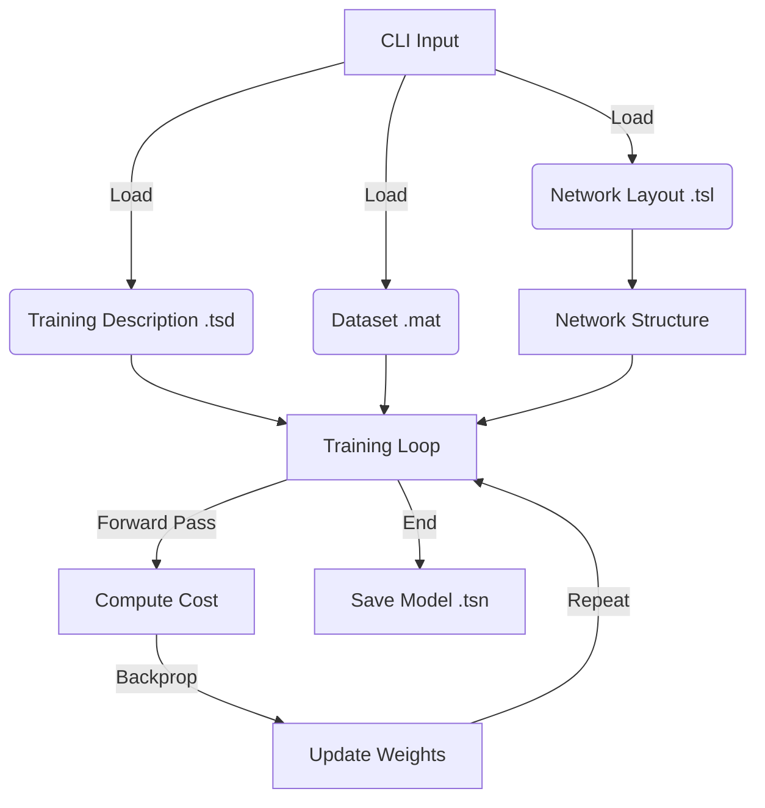
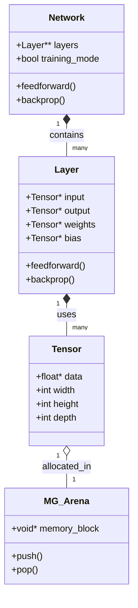

# MLFramework

A custom, high-performance Machine Learning Framework written in C. This framework provides a flexible neural network implementation with a command-line interface for training and inference.

## Key Highlights

### 1. Custom Memory Arena Allocator (`mg_arena`)
This framework utilizes a custom **Linear Memory Arena** allocator instead of standard `malloc`/`free` calls for deep learning operations. 
- **How it works**: It pre-allocates large blocks of memory (e.g., via `mmap` on macOS/Linux or `VirtualAlloc` on Windows) and assigns pointers by simply incrementing an offset. This is O(1) allocation.
- **Benefits**:
  - **Performance**: drastic reduction in allocation overhead and memory fragmentation.
  - **Cache Locality**: Related data structures are allocated contiguously, improving CPU cache hits.
  - **Safety & Cleanup**: Entire arenas can be reset or freed instantly (`mga_reset` or `mga_destroy`), completely eliminating memory leaks common in complex graph structures.

**Example Usage**:
```c
mga_desc desc = { .desired_max_size = MGA_MiB(512), .desired_block_size = MGA_MiB(4) };
mg_arena* arena = mga_create(&desc);

// O(1) Allocation
float* data = MGA_PUSH_ARRAY(arena, float, 1000); 

// No need to free 'data' individually.
mga_destroy(arena); // Frees everything at once.
```

### 2. High-Performance Tensor Engine
At the core is a specialized tensor compute engine designed for neural network workloads.
- **Implementation**: Supports multi-dimensional tensor operations with optimized backends. Includes automatic broadcasting, efficient slicing (views), and vectorized operations where applicable.
- **Benefits**: Provides the computational backbone for training and inference, ensuring operations like Matrix Multiplication, Convolution, and Element-wise arithmetic are fast and numerically stable.

**Example Usage**:
```c
tensor* a = tensor_create(arena, (tensor_shape){28, 28, 1});
tensor* b = tensor_create(arena, (tensor_shape){28, 28, 1});

// Optimized in-place addition
tensor_add_ip(a, b); 
```

### 3. Modular Architecture & CLI
The framework is built with modularity in first principles.

#### Workflow Diagram


#### Architecture (OOP) Structure
Although written in C, the system follows an Object-Oriented design pattern:


## Prerequisites

- CMake (3.31 or later)
- C Compiler (Clang recommended for macOS, GCC for Linux)
- Make or Ninja build system

## Build Instructions

1.  **Clone the repository**:
    ```bash
    git clone <repository_url>
    cd MLFramework
    ```

2.  **Create a build directory**:
    ```bash
    mkdir build
    cd build
    ```

3.  **Run CMake and Build**:
    ```bash
    cmake ..
    cmake --build . --target MLFramework -j 4
    ```

The executable `MLFramework` will be created in your build directory (or `cmake-build-debug` if using CLion/IDE defaults).

## Usage

The framework allows you to train models and run inference via the command line.

### 1. Training

To train a model, you need:
1.  **Network Layout (`.tsl`)**: Defines the architecture of the neural network.
2.  **Data Directory**: Directory containing your training data (e.g., MNIST `.mat` files).
3.  **Training Description (`.tsd`)**: Defines hyperparameters like epochs, batch size, optimizer, and save paths.

**Command:**
```bash
./MLFramework train <layout.tsl> <data_dir> <train_desc.tsd>
```

**Example:**
```bash
./MLFramework train tests/mnist.tsl data/mnist tests/mnist.tsd
```

### 2. Inference

To run inference using a trained model:

**Command:**
```bash
./MLFramework infer <model.tsn> <input_file>
```

**Example:**
```bash
./MLFramework infer tests/model_epoch_0001.tsn dummy_input
```
*(Note: Generic input file loading for inference is currently a placeholder. The system validates model loading.)*


## Snake Reinforcement Learning (DQN)

This project includes a fully functional Reinforcement Learning example where an AI learns to play Snake using Deep Q-Learning (DQN).

### 1. Overview
- **Environment**: A custom 10x10 Snake implementation (`src/examples/snake`).
- **Algorithm**: Deep Q-Network (DQN) with Experience Replay and Epsilon-Greedy exploration.
- **Rendering**: Retro-style console graphics with in-place updates.

### 2. Architecture
- **`snake_game.c`**: Handles game logic (movement, collision, food, state representation).
- **`snake_ai.c`**: Implements the DQN Agent.
    - **Replay Buffer**: Stores moves (State, Action, Reward, Next State) to train on random batches.
    - **Custom Training Loop**: Manually calls `network_feedforward` and `layer_backprop` to implement the Q-Learning update rule: `Q(s,a) = r + gamma * max(Q(s'))`.
- **`snake_main.c`**: CLI entry point for the snake command.

### 3. How to Run

#### Train the Agent
Train the agent from scratch or resume from a checkpoint.
```bash
# Start fresh
./MLFramework snake train

# Resume from a model (e.g., after 300 episodes)
./MLFramework snake train tests/snake/snake_model_300.tsn
```
*Models are saved to `tests/snake/` every 100 episodes.*

#### Watch the AI Play
Load a trained model and watch it play in your terminal.
```bash
./MLFramework snake play tests/snake/snake_final.tsn
```

### 4. Implementation Details
- **State**: A 10x10 grid flattened to 100 inputs. Values: Empty(0), Body(1), Food(2), Head(3).
- **Rewards**:
    - **Food**: +20.0 (High reward for objective)
    - **Death**: -100.0 (Severe penalty for dying)
    - **Step**: -0.1 (Small penalty to encourage speed)
- **Epsilon Decay**: Starts at 1.0 (100% random) and decays to 0.01 over ~1000 episodes to shift from Exploration to Exploitation.

## File Formats

### Network Layout (`.tsl`)
Defines the layers of the network. Example (`tests/mnist.tsl`):
```
input:
    shape = (28, 28, 1);

flatten:

dense:
    size = 128;

activation:
    type = relu;

dense:
    size = 10;

activation:
    type = softmax;
```

### Training Description (`.tsd`)
Defines training parameters. Example (`tests/mnist.tsd`):
```
epochs = 5;
batch_size = 32;
learning_rate = 0.001;
optimizer = adam;
save_interval = 1;
save_path = "tests/model_epoch_";
```

### Data Format
The implemented data loader currently supports MNIST data stored in `.mat` files (custom binary format containing raw float data).
- `train_images.mat`
- `train_labels.mat`
- `test_images.mat`
- `test_labels.mat`

## Project Structure

- `src/`: Source code
  - `layers/`: Layer implementations
  - `tensor/`: Tensor operations
  - `network/`: Network management and training logic
  - `utils/`: Data and description loaders
  - `main.c`: CLI entry point
- `include/`: Public headers
- `data/`: Dataset directory
- `tests/`: specific test configurations
